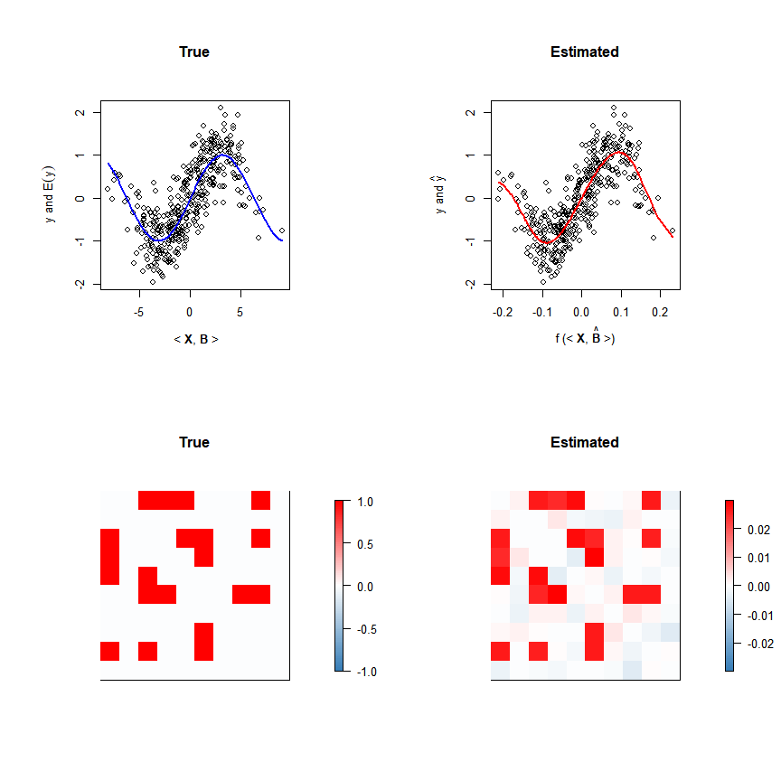
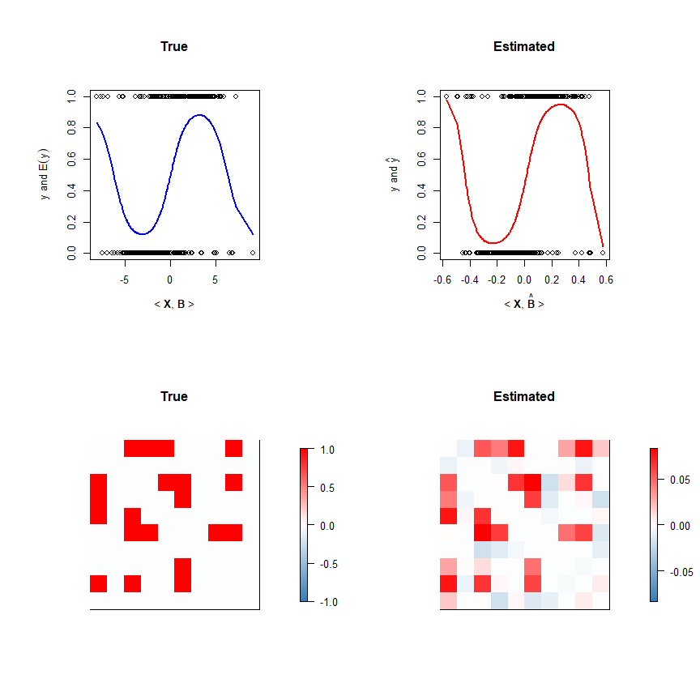

## Implementation of algorithms in "Single Index Models with Functional Connectivity Network Predictors"

### Load source code

``` r
source("fcsim_src.r")
```

### Generate covariate and coefficient matrices

``` r
set.seed(10)
n = 400
p = 10
B = matrix(1,p,p)
idx = as.logical(rbinom(p, 1, .5))
B[idx,] = 0
B[,idx] = 0
idx = matrix(as.logical(rbinom(p*p, 1, .5)), p, p)
B[idx] = 0
B = lower.to.sym(B)
diag(B) = 0
bstar = B[lower.tri(B)]
q = length(bstar)
X = matrix(rnorm(n*q),n,q)
Xb = X%*%bstar
gs = get.groups(p)
```

### Normal response with sin index function

``` r
# Generate response
set.seed(10)
y = sin(Xb/2)+rnorm(400)/2

# Fit model
fit0 = fcsim(X=X,y=y,gs=gs,lambda=.2,family='gaussian',opt="PG")
bhat = fit0[['bhat']]
fhat = fit0[['fhat']]

# Visualize estimated index function and coefficient matrix
par(mfrow=c(2,2))
par(mar=c(7,7,7,7))

ti = Xb
ey = y[order(ti)]
ti = sort(ti)
plot(ti, ey,ylab=expression(paste(y, " and ", E(y))), xlab=expression(paste(" < ",bold(X),", ",bold(B)," >")), main="True")
points(seq(min(ti),max(ti),,100), sin(seq(min(ti),max(ti),,100)/2), col="blue", type="l",lwd=2)

ti = X%*%bhat
pred = fhat(ti)[order(ti)]
ey = y[order(ti)]
ti = sort(ti)
plot(ti, ey,ylab=expression(paste(y, " and ", hat(y))), xlab=expression(paste(f," (< ",bold(X),", ",hat(bold(B))," >)")), main="Estimated")
points(ti, pred, col="red", type="l",lwd=2)

Bhat = matrix(0,p,p)
Bhat[lower.tri(Bhat)]=bhat
Bhat = lower.to.sym(Bhat)
matshow(B,main="True")
matshow(Bhat,main="Estimated")
```

<!-- -->

### Binary response with sin index function

``` r
# Generate response
set.seed(10)
fxb = sin(Xb/2)
prob = ilogit(2*fxb)
y=rbinom(n,1,prob)

# Fit model
fit0 = fcsim(X=X,y=y,gs=gs,lambda=.12,family='binomial',opt="PG")
bhat = fit0[['bhat']]
fhat = fit0[['fhat']]

# Visualize estimated index function and coefficient matrix
par(mfrow=c(2,2))
par(mar=c(7,7,7,7))

ti = Xb
ey = y[order(ti)]
prob = prob[order(ti)]
ti = sort(ti)
plot(ti, ey, ylab=expression(paste(y, " and ", E(y))), xlab=expression(paste("< ",bold(X),", ",bold(B)," >")), main="True"); points(ti, prob, col="blue", type="l",lwd=2)

ti = X%*%bhat
ey = y[order(ti)]
prob = prob[order(ti)]
ti = sort(ti)
plot(ti, ey,xlab=expression(paste("< ",bold(X),", ",hat(bold(B))," >")),ylab=expression(paste(y, " and ", hat(y))), main="Estimated"); 
points(ti, ilogit(fhat(ti)), col="red", main="Estimated",type="l",lwd=2);

Bhat = matrix(0,p,p)
Bhat[lower.tri(Bhat)]=bhat
Bhat = lower.to.sym(Bhat)
matshow(B,main="True")
matshow(Bhat,main="Estimated")
```

<!-- -->
